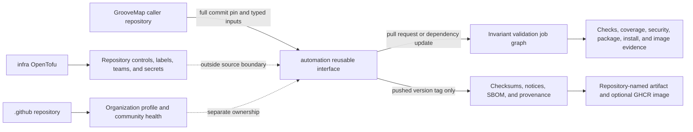

# Architecture

GrooveMap repositories retain their own build and test commands. The automation repository owns
only reusable orchestration and exposes small, versioned interfaces pinned by callers to immutable
commits.

## Design constraints

- Callers select repository-owned commands; shared automation does not infer service behavior.
- External actions and cross-repository calls use full commit revisions.
- Permissions and secrets are explicit interface properties.
- Pull requests use one consistent required job graph, including dependency-update pull requests.
- Missing private-library credentials fail the complete gate; they never select a smaller gate.
- Publishing is isolated to reviewed tag-only release interfaces.
- Local contract tests exercise success, failure, cancellation, and artifact behavior without
  organization credentials.
